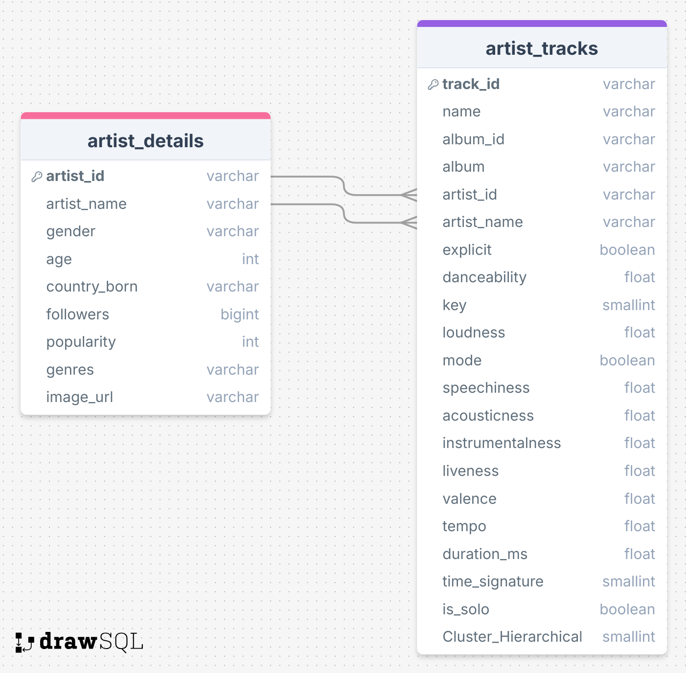
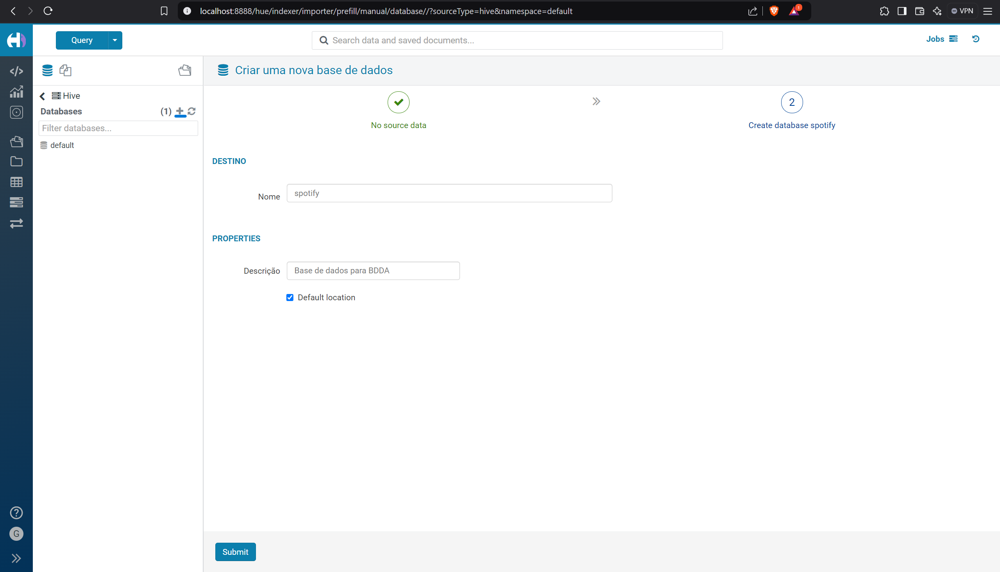
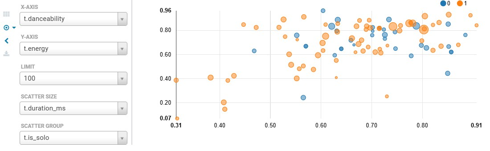
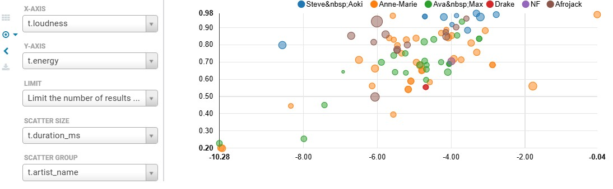

# **BDDA - Bases de Dados Distribuídas Avançadas**  
_Relatório: Componente Técnica_

---

***<h1 style="text-align:center; background-color: #000000; color: #ffffff; padding: 20px; border-radius: 10px; font-family: 'Arial', sans-serif; font-size: 36px; text-shadow: 2px 2px 5px rgba(0, 0, 0, 0.5); letter-spacing: 1px;">A música é influenciada pelo local de nascimento do artista?</h1>***

---

### Tempo para apresentação do projeto:


## **Trabalho realizado por:**
- **Diogo Freitas** (104841)  
- **João Francisco Botas** (104782)  
- **Rebeca Sampaio** (126628)

## **Índice**
1. [Introdução](#introdução)
2. [Metodologia e Stack Hadoop](#metodologia-e-stack-hadoop)
3. [Descrição dos Conjuntos de Dados Utilizados](#descrição-dos-conjuntos-de-dados-a-utilizar)
    - [Análise e Conclusões sobre os Artistas](#dataset-1-artist_details)
    - [Análise e Conclusões sobre as Músicas dos Artistas](#dataset-2-artist_tracks)
4. [Conclusão](#conclusão)

## **Introdução**
> **Objetivo**: Apresentar um relatório sobre o uso de bases de dados distribuídas avançadas no contexto do projeto desenvolvido.
Neste relatório, vamos contextualizar as seguintes etapas:

- **A recolha dos datasets essenciais para a recolha do projeto:**  
   Estes datasets foram recolhidos a partir do [Kaggle](https://www.kaggle.com) e da [_API_ da _Spotify_](https://dev.twitch.tv/docs/api/). Durante o processo de recolha, surgiram alguns precalces que precisaram ser corrigidos, e as soluções adotadas serão explicadas mais à frente. Após os ajustes necessários, os dados foram preparados e exportados para o [_HDFS_](https://www.geeksforgeeks.org/hadoop-hdfs-hadoop-distributed-file-system/). Os dois datasets recolhidos foram:
    1. **[_artist_details_](#dataset-1-_artist_details_)**  
       - Este dataset contém informações detalhadas sobre os artistas, incluindo características como o género musical, a idade, o local de nascimento e o género de cada artista.

    2. **[_artist_tracks_](#dataset-2-_artist_tracks_)**  
       - O segundo dataset descreve as características das músicas dos artistas, estando relacionado ao primeiro por meio da chave estrangeira (_foreign key_) associada ao _id_ de cada artista. Através deste dataset, é possível verificar o tipo de música de cada artista, analisando características como a dançabilidade, a duração e a complexidade da música.
    
    - O código em **Python** referente aos dados mencionados acima podem ser encontrado no seguinte diretório: [**`src/data`**](src/data)
      - Recolha dos dados do Kaggle: [**`get_data.py`**](src/data/get_data.py)
      - Recolha dos dados da **_API_**: [**`API_Spotify.py`**](src/data/API_Spotify.py)


   Abaixo, podemos visualizar a relação entre as tabelas, juntamente com as respetivas colunas, que serão explicadas mais detalhadamente à [frente](#descrição-dos-conjuntos-de-dados-a-utilizar).


   <div style="text-align: center;">
       
   </div>

- **As metodologias utilizadas e a stack _Hadoop_ empregue para a realização do projeto:**

   Neste trabalho, foram empregadas ferramentas como o [**Hadoop**](https://hadoop.apache.org/), [**Hive**](https://hive.apache.org/) e [**GetHue**](https://gethue.com/) para a análise e visualização dos dados. A integração dessas tecnologias permitiu uma análise eficiente e escalável, além de facilitar a interação com grandes volumes de dados. 

    - A [**stack Hadoop**](https://hadoop.apache.org/) foi utilizada para processar e executar as **queries** de forma distribuída e eficiente, aproveitando a escalabilidade do sistema.
    - O [**Hive**](https://hive.apache.org/) foi utilizado para a criação de tabelas e a execução de **queries SQL** sobre os dados armazenados no **HDFS**, proporcionando uma interface familiar para análise de grandes volumes de dados.
    - O [**Hue**](https://gethue.com/) foi empregado para facilitar a visualização dos dados e a criação de **dashboards** interativos, permitindo realizar **queries** de maneira intuitiva e facilitando a análise visual dos resultados.


- **Base do Projeto, Visualizações e Conclusões Extraídas**
   
   Para finalizar com a explicação de cada uma das etapas do projeto, destacam-se os seguintes pontos:

  1. **Objetivos de Estudo**  
     - A principal hipótese formulada pelo grupo é analisar se a região onde o artista nasceu exerce alguma influência nas suas músicas. Para validar essa hipótese, foi essencial comparar e correlacionar as diferentes características das músicas e dos artistas. Este estudo também incluiu a análise de outras propriedades dos artistas, como género, faixa etária e estilos musicais.

  2. **Visualizações**  
     - Todas as visualizações que corroboram as nossas conclusões foram realizadas na plataforma [_Hue_](https://gethue.com/), com exceção das visualizações geradas no _Jupyter Notebook_, que foram utilizadas para análises complementares e outros fins.

  3. **Base do Projeto**  
     - Antes de prosseguir com a explicação detalhada do projeto, é apresentada abaixo uma visão geral da sua estrutura:
   

```
Directory structure:
└── Vullkano-BDDA/
    ├── README.md
    ├── LICENSE
    ├── docker-compose.yml
    ├── hadoop-hive.env
    ├── hue-overrides.ini
    ├── requirements.txt
    ├── data/
    │   ├── .gitignore
    │   └── processed/
    │       ├── artist_details.csv
    │       ├── artist_details.parquet
    │       ├── artist_tracks.csv
    │       └── artist_tracks.parquet
    ├── docs/
    │   ├── Utilizador.txt
    │   ├── enunciado/
    │   └── relatorios/
    │       ├── relatorio pratico imgs/
    │       └── relatorio teorico/
    │           ├── main.typ
    │           └── setup/
    │               ├── capa.typ
    │               ├── esquema_relatorio.typ
    │               ├── sourcerer.typ
    │               └── template.typ
    ├── notebook/
    │   ├── main.ipynb
    │   ├── spotify.db
    │   ├── sql.ipynb
    │   └── .gitignore
    └── src/
        ├── data/
        │   ├── API_Spotify.py
        │   ├── get_data.py
        │   ├── parquet_converter.py
        │   ├── .gitignore
        │   └── __pycache__/
        └── model/
            ├── unsupervised.py
            └── .gitignore

```

  - **`data/`**: Diretório que armazena os datasets utilizados no projeto. Está organizado em duas categorias principais:  
     - **`raw/`**: Dados brutos recolhidos diretamente das fontes originais, sem qualquer tratamento ou modificação.  
     - **`processed/`**: Dados já tratados, limpos e prontos para serem utilizados na análise e na visualização.
  - **`docs/`**: Contém a documentação do projeto, incluindo o enunciado, relatórios teóricos e práticos.
  - **`notebook/`**: Contém os notebooks utilizados para a análise dos dados e a criação de visualizações.
  - **`src/`**: Contém os scripts utilizados para a recolha, processamento e análise dos dados, bem como a implementação de modelos de aprendizagem não supervisionada.

## **Metodologia e stack Hadoop**
Para a realização deste projeto, foi utilizado um ficheiro [_docker-compose.yml_](https://github.com/Vullkano/BDDA/blob/main/docker-compose.yml), que se baseia em imagens disponíveis no Docker Hub. Estas imagens oferecem uma estrutura pré-configurada, facilitando a criação e configuração rápida do ambiente necessário para o funcionamento do cluster Hadoop e dos serviços associados. Segue-se uma visualização das componentes definidas no ficheiro, acompanhada de uma breve explicação de cada uma:

```
version: "3"

services:
  namenode:
    image: bde2020/hadoop-namenode:2.0.0-hadoop2.7.4-java8
    volumes:
      - namenode:/hadoop/dfs/name
    environment:
      - CLUSTER_NAME=test
    env_file:
      - ./hadoop-hive.env
    ports:
      - "50070:50070"
    
  datanode:
    image: bde2020/hadoop-datanode:2.0.0-hadoop2.7.4-java8
    volumes:
      - datanode:/hadoop/dfs/data
    env_file:
      - ./hadoop-hive.env
    environment:
      SERVICE_PRECONDITION: "namenode:50070"
    ports:
      - "50075:50075"

  resourcemanager:
    image: bde2020/hadoop-resourcemanager:2.0.0-hadoop2.7.4-java8
    environment:
      SERVICE_PRECONDITION: "namenode:50070 datanode:50075"
    env_file:
      - ./hadoop-hive.env

  hive-server:
    image: bde2020/hive:2.3.2-postgresql-metastore
    env_file:
      - ./hadoop-hive.env
    environment:
      HIVE_CORE_CONF_javax_jdo_option_ConnectionURL: "jdbc:postgresql://hive-metastore/metastore"
      SERVICE_PRECONDITION: "hive-metastore:9083"
    ports:
      - "10000:10000"

  hive-metastore:
    image: bde2020/hive:2.3.2-postgresql-metastore
    env_file:
      - ./hadoop-hive.env
    command: /opt/hive/bin/hive --service metastore
    environment:
      SERVICE_PRECONDITION: "namenode:50070 datanode:50075 hive-metastore-postgresql:5432 resourcemanager:8088"
    ports:
      - "9083:9083"

  hive-metastore-postgresql:
    image: bde2020/hive-metastore-postgresql:2.3.0
    ports:
      - "5432:5432"

  huedb:
    image: postgres:12.1-alpine
    volumes:
      - pg_data:/var/lib/postgresl/data/
    ports:
      - "5432"
    env_file:
      - ./hadoop-hive.env
    environment:
        SERVICE_PRECONDITION: "namenode:50070 datanode:50075 hive-metastore-postgresql:5432 resourcemanager:8088 hive-metastore:9083"
  
  hue:
    image: gethue/hue:4.6.0
    environment:
        SERVICE_PRECONDITION: "namenode:50070 datanode:50075 hive-metastore-postgresql:5432 resourcemanager:8088 hive-metastore:9083 huedb:5000"
    ports:
      - "8888:8888"
    volumes:
      - ./hue-overrides.ini:/usr/share/hue/desktop/conf/hue-overrides.ini
    links:
      - huedb

volumes:
  namenode:
  datanode:
  pg_data:
```

- **NameNode** (`bde2020/hadoop-namenode`):  
  Gere os metadados do HDFS. Armazena-os num volume persistente e expõe a interface web na porta `50070`.

- **DataNode** (`bde2020/hadoop-datanode`):  
  Armazena os blocos de dados no HDFS. Utiliza um volume dedicado e verifica se o NameNode está ativo antes de iniciar. Porta: `50075`.

- **ResourceManager** (`bde2020/hadoop-resourcemanager`):  
  Gere os recursos e tarefas no cluster Hadoop. Funciona em conjunto com NameNode e DataNodes.

- **Hive Server** (`bde2020/hive`):  
  Permite executar consultas SQL no Hadoop (via Hive). Liga-se ao Hive Metastore, que usa PostgreSQL para armazenar metadados. Porta: `10000`.

- **Hue** (`gethue/hue`):  
  Fornece uma interface gráfica para interagir com Hadoop, Hive, e outros serviços. Configurado para ligar a todos os componentes do cluster. Porta: `8888`.

> Outras Notas
>  - Todos os serviços dependem uns dos outros para garantir a ordem correta de inicialização.
>  - Volumes persistentes são usados para garantir a durabilidade dos dados, mesmo que os containers sejam reiniciados.
>  - Ficheiros de configuração (`.env` e `hue-overrides.ini`) permitem personalizar as variáveis e o comportamento do cluster.

### Inicialização do servidor 

Após iniciar o Docker e os respetivos containers utilizando as imagens configuradas no ficheiro [_docker-compose.yml_](https://github.com/Vullkano/BDDA/blob/main/docker-compose.yml), foi necessário criar um utilizador. As credenciais do utilizador podem ser consultadas no ficheiro [_Utilizador.txt_](docs\Utilizador.txt).  

Após a criação do utilizador, ao aceder à interface do _HUE_, foi necessário criar a base de dados onde seriam inseridas as tabelas previamente criadas. Abaixo, apresenta-se uma imagem que demonstra a criação da base de dados _spotify_.

   <div style="text-align: center;">
       
   </div>

Para a inserção das tabelas, era necessário ter os mesmos dados nos formatos **_.csv_** e **_.parquet_**, pois o [**CSV**](https://en.wikipedia.org/wiki/Comma-separated_values) é utilizado para carregar dados rapidamente, enquanto o [**Parquet**](https://www.databricks.com/br/glossary/what-is-parquet) garante uma análises eficiente e de alto desempenho no Hadoop. Após a inserção de todas as tabelas, estas tornaram-se visíveis no dashboard do HUE (pode ser visualizado à esquerda, abaixo da **database** do Spotify). Para verificar se tudo estava a funcionar corretamente, foi executado o seguinte comando SQL:

```sql
SELECT * FROM spotify.hue__tmp_artist_details
```

Abaixo, podemos visualizar o output e concluir que está tudo pronto para começar a análise das respetivas tabelas.

   <div style="text-align: center;">
       
   </div>

## **Descrição dos conjuntos de dados a utilizar**
### Dataset 1: _artist_details_

Para a criação deste dataset, foi necessário recolher o nome de alguns artistas e, para tal, foi realizada uma pesquisa, tendo sido descobertos os seguintes dados no **Kaggle**: [Link para o Dataset](https://www.kaggle.com/datasets/hedizekri/top-charts-artists-country). Neste link do Kaggle, encontrámos dados relativos ao nome e ao país de origem de cada um dos artistas. Para adicionar ainda mais informações, o grupo também conseguiu recolher metadados adicionais sobre os artistas no seguinte [_dataset_](https://www.kaggle.com/datasets/jackharding/spotify-artist-metadata-top-10k). No entanto, o grupo percebeu que esta base de dados ainda podia ser enriquecida com informações da [API do Spotify](https://developer.spotify.com/documentation/web-api/reference/get-an-artist).

Após a recolha dos dados, foi necessário realizar a sua limpeza. Todo o processo de limpeza pode ser visualizado no ficheiro [**`notebook/main.ipynb`**](notebook/main.ipynb). Abaixo, podemos visualizar todas as variáveis do primeiro dataset após a sua limpeza.
  
| Coluna        | Type         | Description                           |
|----------------|--------------|-------------------------------------|
| `artist_id`      | string      | Id único para o artista (do próprio Spotify)          |
| `artist_name`      | string | Nome do artista (apenas artistas solo) |
| `gender`      | string | Género do Artista |
| `age`      | int | Idade do artista (pode ter algumas incoerências) |
| `country_born`      | string | País em que o artista nasceu          |
| `followers`      | int | Número de seguidores que o artista tem no Spotify          |
| `popularity`      | int | Nível de popularidade do artista medido de 0 a 100          |
| `genres`      | array | Lista de todos os géneros de música do artista          |
| `image_url`      | string | Imagem do artista no Spotify (apenas para confirmar a identidade no processo de limpeza)          |

Para proporcionar uma visão mais clara dos dados, abaixo apresentamos uma tabela com **algumas** das características recolhidas, incluindo o _header_ para facilitar a compreensão.

| artist_name    | gender | age  | country_born    | (...)                        | genres                                           | image_url                                                                                         |
|----------------|--------|------|-----------------|----------------------------------|-------------------------------------------------|---------------------------------------------------------------------------------------------------|
| Drake          | male   | 38.0 | Canada          | (...)                            | hip hop, pop rap, rap |                         |
| Post Malone    | male   | 29.0 | United States   | (...)                            | dfw rap, melodic rap, pop, rap                  |                   |
| Ed Sheeran     | male   | 33.0 | United Kingdom  | (...)                            | pop, singer-songwriter pop              |                    |


#### Análise dos dados do Dataset 1
Para realizar esta análise, será utilizado o dashboard para a visualização dos dados. Abaixo, podemos observar alguns gráficos que ilustram as principais conclusões obtidas.

##### 1. Géneros dos artistas

   <div style="text-align: center;">
       
   </div>

Na imagem acima, é evidente que a nossa base de dados contém um número significativamente maior de artistas do sexo masculino em comparação com o sexo feminino. Contudo, é importante ressaltar que esta base de dados resulta de uma limpeza do conjunto de dados dos "top artistas" provenientes de uma fonte do Kaggle. Assim, não podemos generalizar que existem mais artistas do sexo masculino do que feminino no universo dos artistas de topo, uma vez que esta análise se baseia apenas nos dados disponíveis nesta base específica.

```sql
SELECT
    gender,
    COUNT(*) AS ArtistCount
FROM
    spotify.hue__tmp_artist_details
GROUP BY
    gender;
```

##### 2. Followers & Popularity

   <div style="text-align: center;">
       
   </div>

O gráfico acima aplica 4 variáveis:
- O número de seguidores no eixo do `X`;
- A popularidade do artista no eixo do `Y`;
- A cor de cada uma das bolas representa um género diferente;
- O tamanho das bolas corresponde à idade de cada artista.

> Antes de proceder a qualquer conclusão, é importante referir que a visualização acima possui uma limitação do HUE, que exibe apenas 100 linhas, não apresentando o gráfico com a base de dados completa.

Relacionando a popularidade com o número de seguidores de cada um artistas, é notório que existe uma correlação entre estas 2 variáveis, isto é, quanto mais popular é um artista, mais seguidores ele tem. Somado a isso, podemos visualizar que os artistas masculinos são mais velhos que as artistas femeninas (relembrar que esta conclusão é limitada devido ás limitações do HUE). É interessante reparar que a artista mais famosa e com mais seguidores é do sexo femenino, sendo ela a [**Taylor Swift**](https://open.spotify.com/intl-pt/artist/06HL4z0CvFAxyc27GXpf02). Abaixo, podemos então visualizar os artistas mais famosos:

   <div style="text-align: center;">
       
   </div>

##### 3. Género de música de cada um dos artistas


Uma característica muito interessante de se analisar, mas ao mesmo tempo bastante complexa, é o género musical de cada um dos artistas. Na tabela de exemplo de variáveis do [dataset 1](#dataset-1-artist_details), podemos observar que os três artistas mencionados possuem múltiplos estilos musicais, o que torna difícil compará-los, pois as **strings** dos estilos variam. Para facilitar uma análise mais clara, uma abordagem seria simplificar os géneros musicais.

Por exemplo, o [**Post Malone**](https://open.spotify.com/intl-pt/artist/246dkjvS1zLTtiykXe5h60) possui como géneros _rap_ e _melodic rap_, mas, de forma geral, podemos agrupá-lo como _rap_, já que esses estilos não se diferenciam significativamente. Tendo isso em mente, para realizar uma análise simplificada, foram considerados apenas os géneros mais conhecidos e amplos, sendo esses os seguintes:


   <div style="text-align: center;">
       
   </div>

Analisando detalhadamente, o **pop** é, de longe, o estilo com o maior número de artistas, seguido pelo **hip-hop** e **rap**, ambos com números consideravelmente menores. Os estilos **eletrónica** e **rock** são muito menores, somando menos do que todos os outros estilos restantes juntos.


```sql
SELECT 
    CASE
        WHEN genres LIKE '%hip hop%' THEN 'Hip-Hop'
        WHEN genres LIKE '%pop%' THEN 'Pop'
        WHEN genres LIKE '%rock%' THEN 'Rock'
        WHEN genres LIKE '%rap%' THEN 'Rap'
        WHEN genres LIKE '%electronic%' THEN 'Electronic'
        WHEN genres LIKE '%r&b%' THEN 'R&B'
        ELSE 'Outro'
    END AS estilo_principal,
    COUNT(*) AS quantidade
FROM spotify.hue__tmp_artist_details
GROUP BY 
    CASE
        WHEN genres LIKE '%hip hop%' THEN 'Hip-Hop'
        WHEN genres LIKE '%pop%' THEN 'Pop'
        WHEN genres LIKE '%rock%' THEN 'Rock'
        WHEN genres LIKE '%rap%' THEN 'Rap'
        WHEN genres LIKE '%electronic%' THEN 'Electronic'
        WHEN genres LIKE '%r&b%' THEN 'R&B'
        ELSE 'Outro'
    END;
```

##### 4. Local de nascimento dos artistas

   <div style="text-align: center;">
       
   </div>

Na imagem acima, podemos observar a contagem do número de artistas por país de nascimento. É evidente que este gráfico reflete um _top 5_ dos locais de nascimento, organizado de forma decrescente. De maneira notável, os **EUA** destacam-se como o país com o maior número de artistas na nossa base de dados, apresentando uma quantidade significativamente superior aos demais. Em segundo lugar, encontramos o Reino Unido, seguido do Canadá. A partir do quarto lugar, os valores tornam-se consideravelmente menores, tornando-se até difíceis de visualizar.

Ao separar os dados por género, vemos que os três primeiros países possuem mais artistas do sexo masculino, como era de se esperar. Contudo, um dado interessante é que, por exemplo, a Austrália apresenta exclusivamente artistas do sexo feminino, o que revela disparidades curiosas entre os países analisados.

```sql
SELECT
    country_born,
    COUNT(*) AS total_count,
    SUM(CASE WHEN gender = 'Male' THEN 1 ELSE 0 END) AS male_count,
    SUM(CASE WHEN gender = 'Female' THEN 1 ELSE 0 END) AS female_count
FROM
    spotify.hue__tmp_artist_details
GROUP BY
    country_born;
```

Para termos uma noção da proporção, vamos então visualizar um gráfico circular que nos permite ter noção desta disparidade.

   <div style="text-align: center;">
       
   </div>

Analisando o gráfico acima, é evidente que os Estados Unidos representam a maioria absoluta do nosso dataset, com uma participação superior a 60%. É interessante notar que os três primeiros países do nosso _top3_ correspondem a quase 75% da nossa base de dados.

### Dataset 2: _artist_tracks_

Para a criação do segundo conjunto de dados, o grupo inicialmente planeava utilizar a API do Spotify para recolher não apenas as músicas dos artistas, mas também as respetivas características. No entanto, deparou-se com um grande problema: a API foi [descontinuada](https://developer.spotify.com/documentation/web-api/reference/get-audio-features) na parte relativa à recolha de análises das músicas. Isto deveu-se à política do Spotify, que restringiu a utilização de *machine learning* com base nas suas músicas.

Para solucionar esta limitação, o grupo procurou uma base de dados alternativa que permitisse realizar a interligação desejada. Foi encontrada uma base de dados com mais de [1,2 milhões de músicas](https://www.kaggle.com/datasets/rodolfofigueroa/spotify-12m-songs), criada a partir de recolhas feitas antes das alterações na API do Spotify. Como esta base de dados incluía o *ID* dos artistas, tornou-se viável realizar a interligação entre os dados das tabelas e proceder à limpeza necessária.

Abaixo, podemos visualizar as características de cada uma das colunas:

|Id                    | Type        | Description
|----------------|--------------|-------------------------------------|
| `track_id`            | string          |Identificador único para cada faixa no Spotify.|
| `name`            | string      |É o título da música. Representa o nome da música de como é exibida no Spotify.|
| `album_id`            | string      |É o ID único de um álbum no Spotify. Assim como as músicas, cada álbum também tem um código exclusivo.|
| `album`            | string      |Nome do álbum ao qual a música pertence.|
| `artist_id`            | string      |Identificador único para o artista (do próprio Spotify).|
| `artist_name`            |string              | Nome do artista principal da música.|
| `release_date`            |string              |Data de lançamento da música (em formato AAAA-MM-DD).|
| `duration_ms`             |int              |Duração da música em milissegundos.|
| `explicit`            |boolean      |Indica se a música contém conteúdo explícito (true/false).|
| `danceability`            |float              |Medida de quão dançável é a música (0.0 a 1.0).|
| `energy`                    |float              |Medida de quão energética é a música (0.0 a 1.0).|
| `loudness`            |float              |Volume médio da música em decibéis (dB).|
| `speechiness`            |float              |Mede a presença de palavras faladas na música, variando de 0 (nenhuma fala) a 1 (somente fala).|
| `acousticness`            |float              |Probabilidade de a música ser acústica (0.0 a 1.0).|
| `instrumentalness`    |float              |Probabilidade de a música ser instrumental (0.0 a 1.0).|
| `liveness`            |float              |Probabilidade de a música ter sido gravada ao vivo (0.0 a 1.0).|
| `valence`                    |float               |Medida de positividade ou felicidade transmitida pela música (0.0 a 1.0).|
| `tempo`                    |float              |tempo estimado da música em batidas por minuto (BPM).|
| `time_signature`            |int              |Assinatura de tempo da música (ex: 4, 3).|
| `key`                    |int              |Representa a tonalidade principal da música usando números (0 a 11), |
| `mode`                    |boolean              |Indica se a música está em tom maior ou menor. (0=menor, 1=maior).|
| `is_solo`                    |boolean              |Indica se a música foi feita a solo ou com feature. (0=feature, 1=solo).|
| `cluster_hierarchical`                    |int              |Indica o grupo de agrupamento que foi atribuído no [clustering hierárquico](https://github.com/Vullkano/BDDA/blob/main/src/model/unsupervised.py). (4 grupos diferentes -> [Visualização](docs\relatorios\relatorio_pratico_imgs\clusterhierarquico.png))

#### 1. Relação entre danceability e energy (agrupado por is_solo)

Como primeira relação achámos relevante ver se o quão a música era dançável relacionava-se com a energia da mesma; agrupámos para as músicas solo e feature para perceber se os features tendiam para serem músicas mais "mexidas" ou não. Para isso, fizemos a query seguinte:
```sql
SELECT t.*
FROM spotify.hue__tmp_artist_tracks t
JOIN spotify.hue__tmp_artist_details d
  ON t.artist_id = d.artist_id
WHERE d.country_born = 'United States'; -- != 'United States'
```

**NOTA**: Uma das limitações é que só são mostrados 100 músicas nos gráficos de dispersão seguintes. Apesar disso, é válido fazer uma análise para esta amostra.

<details open>
  <summary>Gráfico de dispersão danceability/energy <strong>artistas nascidos nos EUA</strong></summary>
<div style="text-align: center;">
       
</div>
</details>

<details open>
  <summary>Gráfico de dispersão danceability/energy <strong>artistas nascidos fora dos EUA</strong></summary>
<div style="text-align: center;">
       
</div>
</details>

Após observarmos os gráficos de dispersão para os artistas nascidos nos EUA e os que nasceram fora dos EUA, é possível perceber que as duas variáveis têm pouca correlação entre elas; não é muito evidente. Também reparamos que normalmente as músicas com features são mais energéticas e dançáveis, exceto algumas exceções (principalmente fora dos EUA)

Comparando os EUA com os de fora dos EUA, vemos que a dispersão é mais ou menos parecida. Porém, os artistas nascidos fora dos EUA atingem valores mais altos de energia e têm uma dispersão maior de valores de danceability para músicas com features, do que os nascidos nos EUA. 
De realçar também que as músicas com menos "dançabilidade" têm um tempo de duração inferior relativamente às dos artistas nascidos nos EUA (tamanho das bolhas).


#### 2. Média de danceability por artist_name

```sql
SELECT t.artist_name, AVG(t.danceability) AS avg_danceability
FROM spotify.hue__tmp_artist_tracks t
JOIN spotify.hue__tmp_artist_details d
  ON t.artist_id = d.artist_id
WHERE d.country_born = 'United States' -- != 'United States'
GROUP BY t.artist_name
ORDER BY avg_danceability DESC;
```

**NOTA**: Só são considerados os álbuns com 100 maior média de danceability.

<details>
  <summary>Tabela com músicas de artistas nascidos nos EUA (TOP-5 e LOW-5)</summary>

| Posição | Artista (Nascidos nos EUA)          | Mean(danceability)       |
|---------|-------------------------------------|--------------------------|
| 1       | Kanye West                         | 0.9045000000000001       |
| 2       | Jack Harlow                        | 0.8810588235294118       |
| 3       | Lil Pump                           | 0.8731694915254237       |
| 4       | Iggy Azalea                        | 0.8694054054054056       |
| 5       | Regard                             | 0.864                    |
| ...     | ...                                 | ...                      |
| 96      | Wyclef Jean                        | 0.6716569343065695       |
| 97      | Trevor Daniel                      | 0.671235294117647        |
| 98      | Jaymes Young                       | 0.67                     |
| 99      | NF                                 | 0.669                    |
| 100     | Kali Uchis                         | 0.6683636363636363       |

</details>

<details>
  <summary>Tabela com músicas de artistas nascidos fora dos EUA (TOP-5 e LOW-5)</summary>

| Posição | Artista (Nascidos fora dos EUA)          | Mean(danceability)       |
|---------|------------------------------------------|--------------------------|
| 1       | Drake                                   | 0.8546666666666667       |
| 2       | Daddy Yankee                            | 0.8325                   |
| 3       | Shaggy                                  | 0.8215                   |
| 4       | Nio Garcia                              | 0.8196666666666667       |
| 5       | Dizzee Rascal                           | 0.8168                   |
| ...     | ...                                     | ...                      |
| 96      | Ellie Goulding                          | 0.62                     |
| 97      | Dido                                    | 0.619891891891892        |
| 98      | MØ                                      | 0.6172608695652174       |
| 99      | Alan Walker                             | 0.61572                  |
| 100     | Olly Murs                               | 0.6138076923076923       |

</details>

<br>


Através desta relação queremos comparar os top-5 e os low-5 com média de dançabilidade entre os diferentes artistas. Nos EUA destacamos o Kanye West como a pessoa que produz músicas mais dançáveis, em média, e a Kali Uchis e NF como menos dançáveis (em média). Já dos artistas nascidos fora dos EUA destacamos o Drake e o Olly Murs a produzir músicas mais e menos dançáveis, em média, respetivamente. Os valores não variam muito e também está dependente do número de músicas que cada artista tem na base de dados.

#### 3. Média de energy por album

```sql
SELECT t.album, AVG(t.energy) AS avg_energy
FROM spotify.hue__tmp_artist_tracks t
JOIN spotify.hue__tmp_artist_details d
  ON t.artist_id = d.artist_id
WHERE d.country_born = 'United States' -- != 'United States'
GROUP BY t.album
HAVING COUNT(t.track_id) > 2
ORDER BY avg_energy DESC;
```

**NOTA**: Só são considerados os álbuns com 100 maior média de energy.

<details>
  <summary>Tabela com álbuns dos artistas nascidos nos EUA (TOP-5 e LOW-5)</summary>

| Posição | Álbum (Artistas nascidos nos EUA)            | Mean(energy)       |
|----------|----------------------------------------------|--------------------|
| 1        | 4OKI                                         | 0.9470000000000001 |
| 2        | Dirty Vibe (Remixes)                        | 0.93075            |
| 3        | 5OKI                                         | 0.9265             |
| 4        | Blow Me (One Last Kiss)                     | 0.9209999999999999 |
| 5        | My Prerogative                              | 0.92075            |
| ...      | ...                                          | ...                |
| 96       | Play It Again                               | 0.7581666666666668 |
| 97       | No Stylist                                  | 0.758              |
| 98       | 50 Hip Hop Classics                         | 0.7576666666666667 |
| 99       | Tempo (feat. Missy Elliott)                 | 0.757              |
| 100      | Cuz I Love You (Super Deluxe)               | 0.7549687500000002 |
</details>

<details>
  <summary>Tabela com álbuns dos artistas nascidos fora dos EUA (TOP-5 e LOW-5)</summary>

| Posição | Álbum (Artistas nascidos nos EUA)                                        | Mean(energy)       |
|----------|--------------------------------------------------------------------------|--------------------|
| 1        | Novo Sonic System                                                       | 0.9480000000000001 |
| 2        | Big Room EDM Anthems: Best of 2019 (Presented by Spinnin' Records)      | 0.9339999999999999 |
| 3        | New Rave                                                                | 0.92275            |
| 4        | Thinking About You (feat. Ayah Marar)                                   | 0.9031666666666668 |
| 5        | Summer (Remixes)                                                        | 0.88775            |
| ...      | ...                                                                     | ...                |
| 96       | Funk Wav Bounces Vol.1                                                  | 0.7425             |
| 97       | Dance                                                                   | 0.7413636363636363 |
| 98       | Laundry Service                                                         | 0.7413000000000001 |
| 99       | Remind Me to Forget (Remixes)                                           | 0.7412500000000001 |
| 100      | Pocketful Of Sunshine                                                   | 0.7411538461538463 |
</details>

<br>
Através da análise da energia média dos álbuns, destacamos os top-5 e os low-5 álbuns com maior e menor média de energia. Entre os artistas nascidos fora dos Estados Unidos, o álbum "Novo Sonic System" destaca-se como o mais energético, enquanto "Pocketful Of Sunshine" apresenta a menor energia média. Já entre os álbuns de artistas nascidos nos Estados Unidos, "4OKI" lidera como o álbum mais energético, enquanto "Cuz I Love You (Super Deluxe)" aparece como o menos energético. De destacar também o álbum "5OKI" que também aparece no TOP-3 (como o "4OKI"->TOP-1), álbuns de autoria de Steve Aoki, um cantor norte-americano de música eletrónica, normalmente mais "energética".


Embora haja variação na energia média, os valores permanecem em uma faixa relativamente estreita, que reflete uma consistência nos géneros ou estilos musicais representados. No entanto, esses resultados também são influenciados pelo número de músicas presentes em cada álbum na base de dados. Para que os valores não fossem demasiado altos optámos por considerar apenas álbuns com mais de 2 músicas presentes na base de dados.

#### 4. Relação entre loudness e energy para artistas com géneros musicais semelhantes

Nesta análise decidimos ver se existe alguma relação entre os géneros de artistas para artistas nascidos nos EUA e fora dos EUA. 

Para isso escolhemos três artistas de géneros de músicas que diferenciam-se pela sua intensidade, ritmo e energia. Associados a estes géneros escolhemos 3 artistas específicos provinientes dos EUA e fora dos EUA; os critérios de escolha foram:
- mesmo estilo principal em comum;
- os resultados anteriores (como NF e Drake que tinham os mesmos);
- quantidade de músicas parecidas presentes na base de dados;
- artistas conhecidos pelo grupo.

<details open>
  <summary>Artistas e géneros selecionados</summary>

| Artista Nascido nos EUA | Artista Nascido Fora dos EUA | Género em Comum          |
|--------------------------|-----------------------------|--------------------------|
| Ava Max                 | Anne-Marie                 | Pop                      |
| NF                      | Drake                      | Hip Hop, Pop Rap         |
| Steve Aoki              | Afrojack                   | EDM, Electro House, Pop Dance |

</details>

```sql
SELECT t.*
FROM spotify.hue__tmp_artist_tracks t
JOIN spotify.hue__tmp_artist_details d
  ON t.artist_id = d.artist_id
WHERE d.artist_name IN ('Ava Max', 'Nf', 'Steve Aoki', 'Anne-Marie', 'Drake', 'Afrojack');
```

<div style="text-align: center;">
       
</div>

Através do gráfico concluímos que as artistas de pop (Anne-Marie e Ava Max) têm os valores de loudness e energy mais dispersos, onde atingem os dois extremos opostos do gráfico. Isto deve-se talvez pela música pop ser muito abrangente e em que duas músicas diferentes podem ter carcaterísticas completamente distintas. Concluindo, não há uma correlação exata entre loudness e energy e não há nada muito significativo entre a artista oriunda dos EUA e da França (Anne-Marie).

Já os artistas de eletrónica (Steve Aoki e Afrojack) têm música com muita energia porque são músicas que fazem vibrar, mas que nem sempre são muito altas, em termos de decibeis, relativamente a algumas de pop. Talvez isto aconteça porque há músicas que têm bastante batida e ritmo, mas que não tocam em notas tão altas; ou que não têm tantas camadas(layers), como voz, _second voices_, etc.. A música "Home We'll Go" do Steve Aoki pode refletir isto ou este [exemplo de playlist](https://www.youtube.com/watch?v=AA0tPSKpznw). Em geral, as músicas a que temos acesso na base de dados do Steve Aoki são mais altas que as do Afrojack.

Os cantores de hip-hop e rap decidimos incluir apenas porque na danceability vimos que o Drake destacava-se como um dos mais dançáveis e o NF como um dos menos. Contudo, percebemos que o NF tem as suas duas músicas mais altas (mais próximas de 0) e mais energéticas que as 3 músicas do Drake da base de dados. Ou seja, considerando apenas estes artistas neste estilo, vimos esta relação engraçada e deveras "surpreendente". Normalmente as letras do NF são mais tristes e tocam em pontos mais sérios, mas com alguma raiva a cantar e com a batida alta do que o Drake que é "mais comercial".


#### 5. Cluster Hierárquico

Como mencionado anteriormente, foi realizado um *clustering* hierárquico simples para analisar se seria possível agrupar as músicas com base nas suas características mais marcantes. Abaixo, apresenta-se um [dendograma](https://support.minitab.com/pt-br/minitab/help-and-how-to/statistical-modeling/multivariate/how-to/cluster-observations/interpret-the-results/all-statistics-and-graphs/dendrogram/) que demonstra que um valor interessante para o número de clusters é **4**:

<div style="text-align: center;">
       
</div>

Após a criação destes grupos, chegou o momento de analisar como cada um deles se comportava. Para isso, foi calculada a média de cada característica das músicas em relação a cada grupo.


```sql
SELECT 
    cluster_hierarchical,
    AVG(danceability) AS avg_danceability,
    AVG(loudness) AS avg_loudness,
    AVG(speechiness) AS avg_speechiness,
    AVG(instrumentalness) AS avg_instrumentalness,
    AVG(valence) AS avg_valence,
    AVG(duration_ms) AS avg_duration_ms
FROM 
    spotify.hue__tmp_artist_tracks
WHERE 
    cluster_hierarchical IN (0, 1, 2, 3)
GROUP BY 
    cluster_hierarchical;
```

Após uma análise detalhada, uma das características mais interessantes foi observada no *cluster 3*, que apresentou músicas com elevada instrumentalidade e pouca presença vocal, como é possível visualizar na imagem abaixo:

<div style="text-align: center;">
       
</div>

Com esta descoberta, foi possível identificar as músicas pertencentes a este grupo, bem como visualizar os respetivos artistas e géneros. Este processo permitiu explorar possíveis padrões relacionados a estas características. Abaixo, podemos então visualizar uma tabela com os resultados:

<div style="text-align: center;">
       
</div>

Ao analisarmos detalhadamente, é notório que este grupo inclui músicas eletrónicas, *remixes*, faixas editadas para rádio e músicas instrumentais. Esse padrão ajuda a explicar o motivo pelo qual as músicas apresentam menos vocais e uma maior presença de instrumentalidade, características típicas de faixas, sejam elas originais ou não, mais focadas na batida. Além disso, é evidente que os artistas deste grupo pertencem a géneros mais orientados para a batida, como: *escape room*, *dance pop*, *electro*, entre outros.

```sql
SELECT 
    t.name AS track_name,
    t.artist_name,
    t.instrumentalness,
    t.speechiness,
    a.genres
FROM 
    spotify.hue__tmp_artist_tracks t
JOIN 
    spotify.hue__tmp_artist_details a ON t.artist_id = a.artist_id
WHERE 
    t.cluster_hierarchical = 3;
```

## Conclusão
Neste trabalho, foi utilizado o **Docker** com uma imagem que integra o **Hive** e o **Phoenix**. Desta forma, era possível criar um ambiente isolado e facilmente escalável no  **Docker**, ideal para trabalhar com grandes volumes de dados de forma eficiente e controlada. A combinação de **Hive** e **Phoenix** no Docker permitiu o armazenamento e consulta eficientes de dados distribuídos, utilizando a capacidade do **Hive** para trabalhar com grandes conjuntos de dados e o **Phoenix** para realizar consultas SQL de maneira rápida sobre o HBase, garantindo um desempenho superior para as análises realizadas.

Durante a análise dos dados, o grupo concentrou-se na exploração das **características das músicas** e dos **artistas**. Relativamente aos **artistas**, foi observado que a base de dados contém uma maior quantidade de artistas dos **Estados Unidos** e do **sexo masculino**. Também foi notada uma alta relação entre o **número de seguidores** e a **popularidade** dos artistas. Outro ponto relevante foi que o género **Pop** se destacou como o mais comum entre os artistas da base de dados.

No que diz respeito às **tracks**, o grupo encontrou uma forte correlação entre as variáveis **danceability** e **energia**. Além disso, um **cluster interessante** foi o **cluster 3**, que se destacou por agrupar **remixes**, **músicas eletrónicas** e **músicas instrumentais**. Esse cluster apresentou uma maior presença de instrumentalidade e menor foco vocal, características típicas de músicas com forte ênfase na batida.

Em termos de conclusões gerais, o trabalho permitiu explorar eficazmente as capacidades do **Docker** na criação de ambientes de trabalho dinâmicos e escaláveis, e contribuiu para a compreensão dos dados musicais através da análise de agrupamentos e características dos artistas e das _tracks_. Este tipo de análise não só revelou padrões valiosos para a indústria musical, como também pode ser expandido para outras áreas de pesquisa que envolvam grandes volumes de dados e a necessidade de processamento distribuído.
